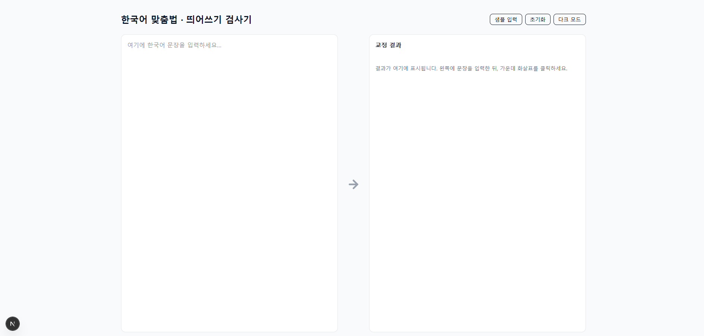
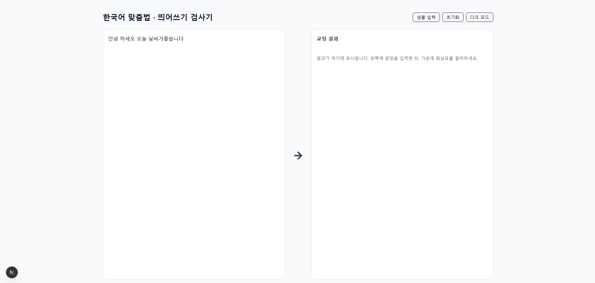
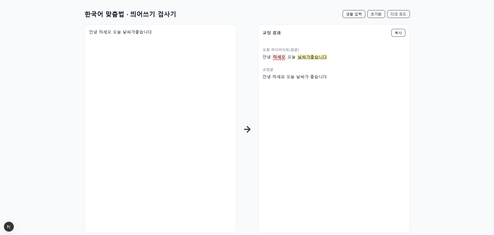
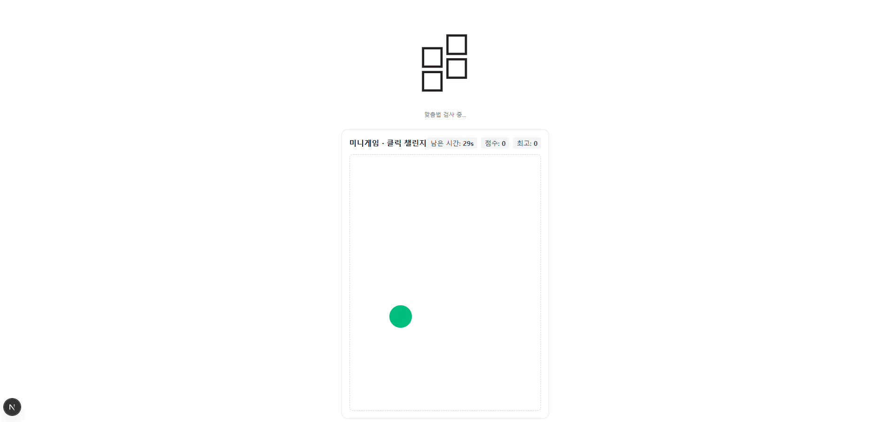

# 한국어 맞춤법 · 띄어쓰기 검사기 (Frontend)

Next.js(App Router)로 만든 한국어 맞춤법/띄어쓰기 검사기 UI입니다.
왼쪽 입력 → 가운데 화살표 클릭 시 검사 실행 → 오른쪽 결과 패널에서 오류 하이라이트+툴팁, 교정문, 비교 보기를 제공합니다.
검사 대기 중에는 전체 페이지 로딩 화면(Lottie + 미니게임)을 표시합니다.

## 📸 스크린샷 (Screenshots)

  
  
  
  

---

## 🚀 Tech Stack

* **Next.js** (App Router, TypeScript, React 18)
* **Tailwind CSS v4** (JIT, `@tailwindcss/postcss`)
* **Framer Motion** (마이크로 인터랙션)
* **lucide-react** (아이콘, 화살표 트리거)
* **Lottie** (`lottie-react`) + **MiniGame** (대기 시간 UX)

*상태관리: 기본은 커스텀 훅(`useSpellcheck`), 필요 시 Zustand/Recoil 확장 가능*

---

## ✨ 주요 기능

* 입력창(Textarea) / **화살표 클릭 시에만** 검사 실행 (자동 실행 X)
* **전체 페이지 로딩 + 미니게임**(대기 UX)
* 결과 표시
* 오류 하이라이트 + 툴팁 (원문 기준)
* 교정문(복사 버튼)
* 원문 vs 교정문 나란히 비교

---

## 🖥 사용 방법 (UX)

1. 왼쪽 박스에 문장을 입력합니다.
2. 가운데 화살표를 클릭하면 검사 실행.
3. 실행 중에는 전체 페이지 로딩 화면이 뜨고, Lottie + 미니게임이 표시됩니다.
4. 완료되면 오른쪽 결과 패널에 아래 순서로 표시됩니다.

   * 오류 하이라이트(툴팁)
   * 교정문(복사 가능)
   * 원문/교정문 비교

---

## 📜 License

이 저장소의 라이선스는 프로젝트 요구에 맞게 선택해주세요. (예: MIT)
*Lottie 애니메이션은 각 리소스의 라이선스를 따르므로 사용 전 확인 바랍니다.*

---

## 🙌 크레딧

* UI/상태 설계, 다크모드 초기화, Tailwind v4 마이그레이션, Lottie·미니게임, 오류 하이라이트+툴팁, 전체 페이지 로딩 UX 등은 실사용 시나리오에 맞춰 구성되었습니다.
* 개선 아이디어/버그 리포트 환영합니다!
